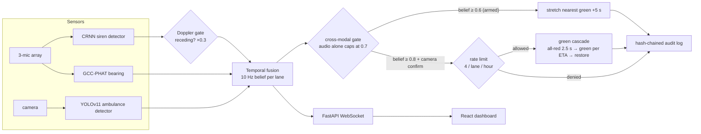

# 🚦 Green Wave++

**Catch an ambulance before it reaches the intersection, and roll the lights green ahead of it.**

Green Wave++ listens for sirens on a microphone array, watches for ambulances
on CCTV, and fuses the two into a running "is an emergency vehicle coming, and
where?" belief. When it's sure enough, it pre-clears a whole corridor of
traffic lights — a rolling green wave timed to the vehicle's arrival — and then
hands every signal back to normal. The hard part isn't turning lights green;
it's being certain enough not to do it for a car horn or a siren on the next
street over. That's where most of the work went.

Built as a final-year project, but evaluated like a paper: every claim below is
something you can reproduce by running a script.

---

## 🎥 See it run

<!--
DEMO VIDEO — to add it: open this README on github.com in edit mode (or open any
issue/release), drag your .mp4 in, wait for it to upload, then copy the
https://github.com/user-attachments/assets/… URL it generates and paste it on
its own line right below this comment. GitHub turns that URL into a video player
automatically. Then you can drop the screenshot underneath as a fallback.
-->

> 📹 **Demo video coming here.** In the meantime, a frame from a live run — the
> siren arms the north lane, the camera confirms, belief hits 1.0, and the
> preemption fires:


---

## Quick start

You don't need a microphone, a camera, trained models, or even SUMO to see it
work — demo mode runs the whole thing on synthetic sensors.

```bash
git clone https://github.com/kbvinay001/Green-wave.git
cd Green-wave/greenwave

pip install -r requirements.txt        # Python side
cd ui && npm install && cd ..          # dashboard (first time only)

python run.py --demo                   # launches backend + dashboard + browser
```

Then open **http://localhost:5173** and watch a siren approach from the north,
arm the lane, get confirmed by the camera, and fire the green wave.

On Windows you can just double-click **`Launch GreenWave++.bat`**. Prefer
containers? One line gets you the API and the dashboard on a single port:

```bash
GREENWAVE_API_KEY=pick-something docker compose up --build
#   → http://localhost:8000/#key=pick-something
```

First launch generates an API key into `common/secrets.yaml` (gitignored) and
hands it to the dashboard for you — nothing to configure.

---

## How it works

A siren becomes a green light through this pipeline. Every box is real code,
and the diamonds are the safeguards that keep a phone speaker from owning the
intersection:



The core idea is **certainty over reflexes**. Instead of firing the moment a
detector spikes, the fusion engine keeps a per-lane belief that builds from the
audio bearing and the camera, decays over time, and has to cross a threshold
*and hold there* before anything happens. A siren with no camera to back it up
can arm a lane but never preempt. A siren that's already driving away gets
weighted down. A horn that blips for half a second decays before it matters.

The green wave itself runs in [SUMO](https://eclipse.dev/sumo/) — a real
4-signal corridor pulled from OpenStreetMap (Benz Circle, Vijayawada). Each
junction goes green at its own ETA, so it's a wave that travels with the
vehicle, not a blanket switch, and every signal restores afterward.

---

## Does it actually work?

Yes — and not just "the demo looks cool." Every row here is measured from
simulation and backed by a script and tests. The full method, figures, and
per-experiment writeups are in **[docs/EVALUATION.md](docs/EVALUATION.md)**.

| The question | The answer | Run it |
|---|---|---|
| Does it help a real ambulance? | **29–35% faster** corridor crossing (20 seeds × 3 demand levels, paired *t*-test *p* < 10⁻⁵) | `evaluation/counterfactual.py` |
| What does it cost everyone else? | **No significant delay** at realistic congestion — under 1 second per vehicle | `evaluation/significance.py` |
| Is the perfect audio score real? | No — 1.000 is the clean ceiling; in street noise it's **0.925**, and it degrades gracefully | `audio/hard_eval.py` |
| Does it stay quiet under attack? | **0 false preemptions** across 4 spoof scenarios (phone speaker, cross-street siren, horns…) | `evaluation/adversarial.py` |
| Better than a naive trigger? | A naive "fire on any detection" baseline false-fires **731×**; ours, **0×** | `evaluation/adversarial.py --compare` |
| Fast enough for real time? | audio **16×**, vision **5.6×**, fusion **~30000×** faster than real time on a laptop GPU | `evaluation/latency.py` |
| Robust to a worse detector? | **Flat** — still saves 62–64 s with detection as low as 20% per frame | `evaluation/sensitivity.py` |
| What if the ambulance turns off? | Self-heals — every signal restores, no stuck greens, +0.16 s cost | `evaluation/route_uncertainty.py` |
| Does it generalize to another city? | Code: **yes** (runs unmodified on a Chennai network). Benefit: needs arterial-class spacing — an honest boundary | `evaluation/second_corridor.py` |

A couple of these are worth calling out because they're easy to fudge and
weren't: the audio model scores a *perfect* 1.000 on the easy held-out set, so
the README reports the honest **0.925** from sirens-in-traffic instead. And the
second-corridor test came back **negative** on a dense junction cluster — that's
reported too, with the reason why, rather than swapped for a corridor that
flattered the numbers.

---

## The detectors, briefly

- **Siren CRNN** (Conv + BiGRU on log-mel spectrograms) — trained on four free
  siren datasets plus UrbanSound8K negatives. **AUC 0.925** in realistic street
  noise (1.000 on clean clips).
- **YOLOv11s ambulance detector** — trained on the Roboflow ambulance dataset.
  **mAP@50 0.80** on held-out test, ~4.8 ms/frame.
- **GCC-PHAT bearing** — a 3-mic array gives the siren's direction, which the
  fusion engine weights by a Gaussian around each lane's heading.

Numbers, training curves, and confusion matrices are in
[docs/EVALUATION.md](docs/EVALUATION.md). Want to retrain? See
[Training your own models](#training-your-own-models) below.

---

## Project layout

```
greenwave/
├── audio/            Siren detection — CRNN, log-mel preprocessing, GCC-PHAT bearing,
│   │                 streaming detector, training, and the hard-noise evaluation
│   └── hard_eval.py  Sirens-in-street-noise test (the honest 0.925)
├── vision/           YOLOv11 ambulance detector — inference, training, data prep
├── fusion/           The brain: TemporalFusionEngine, route predictor, SUMO controller
├── integration/      End-to-end pipeline — sensor threads + async fusion loop + replay
├── ui/               React + Vite dashboard, and the FastAPI WebSocket backend
├── common/           Config, plus the security layer (API keys, rate limiter, audit log)
├── evaluation/       Everything in "Does it actually work?" — one script per question
├── sim/nets/         The SUMO networks: Benz Circle (Vijayawada) + Shollinganallur (Chennai)
├── scripts/          Dashboard screenshots, Cloudflare tunnel
├── tests/            130 tests, including the adversarial CI gate
├── run.py            One launcher for demo / virtual / live / SUMO modes
└── docker-compose.yml
```

---

## Configuration

Everything tunable lives in `common/config.yaml`. The knobs you'll reach for:

| Section | Key | Default | What it does |
|---|---|---|---|
| `fusion` | `arm_threshold` | 0.6 | Belief needed to start arming a lane |
| `fusion` | `preempt_threshold` | 0.8 | Belief needed to actually fire |
| `fusion` | `arm_duration_sec` | 0.5 | How long belief must hold before firing |
| `fusion` | `decay_factor` | 0.92 | Per-second belief decay |
| `sumo` | `all_red_duration` | 2.5 s | Safety clearance before the wave |
| `sumo` | `preempt_green_duration` | 12 s | Green hold per junction |
| `security` | `rate_limit.max_preempts_per_lane` | 4 | Hard cap per lane per hour |

---

## Running it for real

```bash
python run.py --demo                    # synthetic sensors, no hardware
python run.py --virtual --wav clip.wav  # replay a video + WAV as live sensors
python run.py --sumo sim/nets/benz_circle/benz.sumocfg --sumo-gui   # drive real SUMO
python run.py --no-ui                   # backend only
```

To share a live demo over the internet (free, no account), run the backend and
then `scripts/tunnel.bat` for a public `trycloudflare.com` URL.

### Training your own models

```bash
# Audio — download + build the dataset (~7 GB), then train
python audio/prepare_real_data.py --download --build
python audio/train.py --epochs 50

# Vision — convert the Roboflow export to YOLO format, then train
python vision/prepare_data.py --roboflow <download_dir> --verify
python vision/train.py --model yolo11s.pt --epochs 80
```

The training images aren't committed (datasets don't belong in git) — the
download scripts above fetch them.

---

## Requirements

- Python 3.10+ — a CUDA GPU helps but the demo runs on CPU
- Node 18+ for the dashboard
- SUMO 1.18+ *only* if you want the real-network simulation (mock mode works without it)

---

## What's done, and what's next

All five build phases are finished and the evaluation is thorough. The one
thing left is the part that needs hardware:

- **Live mic + camera capture** — the capture threads aren't wired to real
  devices yet; everything downstream already is.
- **Demand-adaptive green hold** — the fixed 12 s hold is what the dense-corridor
  test tripped on. Queue-aware timing would extend the benefit to tight clusters.
- **Multi-corridor arbitration** — two ambulances, different approaches, at once.

---

*Multi-modal emergency-vehicle preemption — GCC-PHAT + YOLOv11 + temporal belief
fusion, in Python, PyTorch, FastAPI, and React.*
