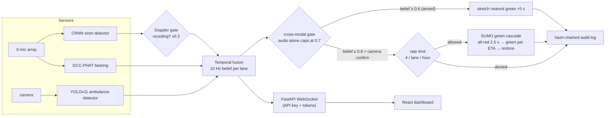
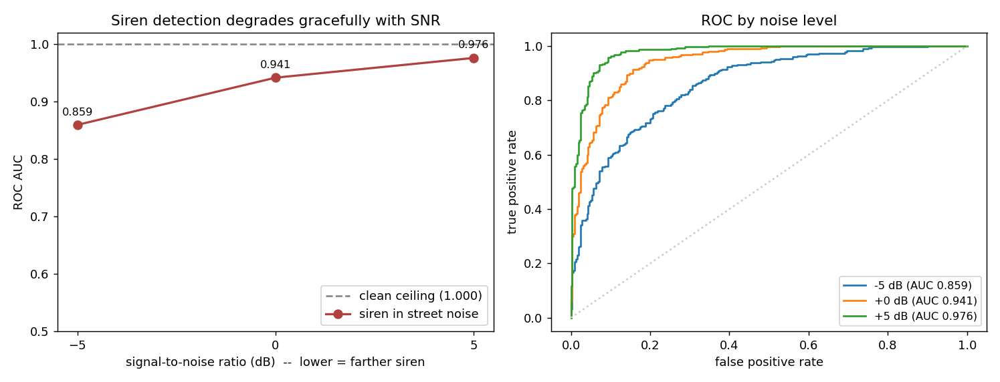
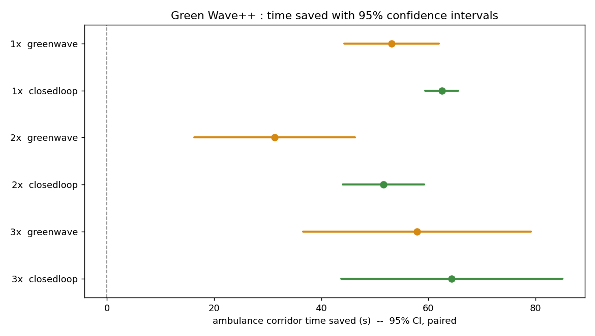
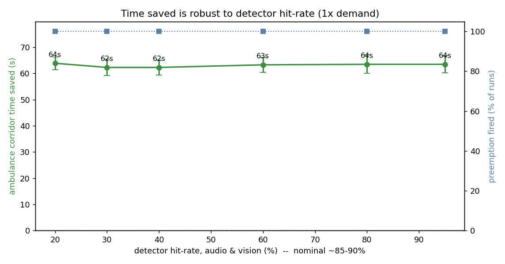
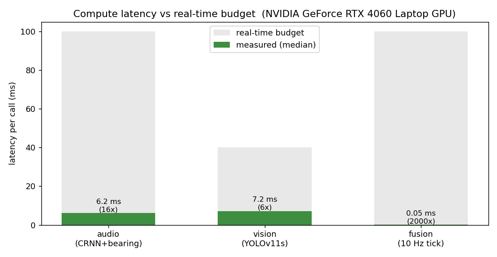

# 🚦 Green Wave++

> **Certainty-aware emergency vehicle preemption using audio-visual fusion.**

> [!NOTE]
> **✅ All five phases complete + a validated evaluation.** Trained detectors, virtual-sensor replay on the real Benz Circle network, trust-gated fusion, security hardening, and a 180-run counterfactual: the full closed-loop system (noisy synthetic sensors → unchanged fusion engine → SUMO signals) clears the ambulance corridor **29–35 % faster across 20 seeds at every density** (paired *t*-test *p* < 10⁻⁵), for no statistically significant cost to other traffic. An adversarial suite confirms **zero false preemptions** across all benign attack scenarios (a naive immediate-preemption baseline false-fires 731×); the siren detector holds **AUC 0.925 in street noise**; and the whole pipeline runs **5–16× faster than real time** on a laptop GPU. Remaining: live mic/camera capture (hardware).

Detects approaching ambulances from CCTV and microphone arrays, fuses the evidence with a temporal belief engine, and pre-clears a corridor of green traffic lights — before the vehicle reaches the intersection.


*The dashboard mid-demo: the siren arms the north lane, the camera confirms, belief hits 1.0, the preemption fires and the north approach goes green — the event log on the right tells the story.*

---

## System Architecture

How a siren becomes a green light — every arrow below is real code, and the
gates are the phase-3/4 safeguards that keep a loud phone speaker from owning
an intersection:



### Key Technical Highlights
- **Temporal belief fusion** — Gaussian-weighted audio bearing + direct vision lane assignment, exponential decay, hysteresis prevents false triggers
- **Certainty gating** — belief must exceed threshold *and hold* for `arm_duration_sec` before preemption fires
- **SUMO-optional architecture** — mock TLS state machine runs on any machine without SUMO installed
- **Demo mode** — full system runs with synthetic audio and vision, no hardware or trained models required

---

## Validation at a glance

Every headline below is **measured, reproducible, and backed by tests** — not
asserted. Full method and figures in the per-phase sections that follow.

| Question a reviewer asks | Answer | Reproduce |
|---|---|---|
| Does it actually help a real ambulance? | **29–35 % faster** corridor crossing, 20 seeds × 3 densities — paired *t*-test *p* < 10⁻⁵, Cohen's *dz* 1.5–9.6 | `evaluation/counterfactual.py` → `significance.py` |
| What does it cost everyone else? | **No statistically significant delay** at 2× / 3× demand (< 1 s at recorded volume) | `evaluation/significance.py` |
| Is the 1.000 audio score real or an easy test? | AUC **1.000 clean → 0.925** in street noise (−5…+5 dB), degrades gracefully | `audio/hard_eval.py` |
| Does it stay quiet when no ambulance is there? | **0 false preemptions** across 4 benign spoof scenarios × 30 seeds | `evaluation/adversarial.py` *(hard CI gate)* |
| Better than a naive trigger-on-detection system? | naive false-fires **731×** (641 from car horns); ours **0×** | `evaluation/adversarial.py --compare` |
| Does it run in real time? | audio **16×**, vision **5.6×**, fusion **~30000×** real-time on a laptop GPU | `evaluation/latency.py` |
| Was "noisy beats perfect" a real finding? | No — a trigger-timing artifact; honestly reframed as *timing dominates detection accuracy* | controlled @80 m re-run |
| How does it behave if the detector is worse? | **Flat** — saves 62–64 s from 95 % down to 20 % per-tick hit rate (temporal accumulation absorbs it) | `evaluation/sensitivity.py` |
| What if the ambulance turns off the corridor? | Self-heals — **every preemption restores** (no stuck greens), wrong route costs +0.16 s | `evaluation/route_uncertainty.py` |
| Does it generalize to another city? | Code: **yes** (runs unmodified on Shollinganallur, Chennai). Benefit: arterial-spacing-dependent — honest negative on a dense cluster | `evaluation/second_corridor.py` |

---

## Results (Phase 1 — trained models)

### Siren CRNN (audio)

Trained on **4,828 three-second windows @ 16 kHz** mixed from four free datasets —
[Emergency Vehicle Siren Sounds](https://www.kaggle.com/datasets/vishnu0399/emergency-vehicle-siren-sounds),
[sireNNet](https://data.mendeley.com/datasets/j4ydzzv4kb/1),
[LSSiren](https://figshare.com/articles/dataset/Large-Scale_Dataset_for_Emergency_Vehicle_Siren_and_Road_Noises/17560865) and
[UrbanSound8K](https://zenodo.org/records/1203745) hard negatives (car horn, drilling,
engine idling, street music) — plus SNR-mixed synthetic sirens.  Train/val split is at
**source-recording level** (no window leakage). Early-stopped at epoch 28/50.

| Val set (716 windows) | AUC | Precision | Recall | Threshold |
|---|---|---|---|---|
| Real (held-out recordings) | **1.0000** | **1.0000** | **1.0000** | 0.373 |
| Synthetic (SNR-mixed) | 1.0000 | 1.0000 | 0.963 | 0.373 |

The 1.000 is the **clean-condition ceiling**, and on its own it is not a
claim worth much: held-out or not, those validation clips are isolated,
studio-clean sirens versus isolated noise, so separating them is an easy
task. The number that matters is the deployment-realistic one.

**Hard test — sirens in street noise** (`audio/hard_eval.py`). The *same
held-out siren recordings* are mixed into fresh UrbanSound8K street noise
(ambient classes, every slice already seen in training removed) across a
sweep of SNR — lower SNR being the distance proxy, a far siren is quiet
relative to the traffic around the mic:

| condition | AUC | Precision | Recall | F1 |
|---|---|---|---|---|
| clean held-out (ceiling) | 1.000 | 1.000 | 1.000 | — |
| +5 dB SNR (near) | 0.976 | 0.919 | 0.934 | 0.927 |
| 0 dB SNR | 0.941 | 0.903 | 0.761 | 0.826 |
| −5 dB SNR (far / heavy traffic) | 0.859 | 0.869 | 0.544 | 0.669 |
| **overall hard set** | **0.925** | 0.965 | 0.746 | 0.842 |



The detector **degrades gracefully** — AUC falls from 1.000 to 0.86 only at
−5 dB, where a distant siren is genuinely buried in traffic. Precision stays
high (0.87–0.92) throughout; what drops is recall at low SNR (0.54 at −5 dB).
That is the *right* failure mode here: the system would rather miss a
far-off siren for a moment than false-preempt, and a real approach gives the
fusion layer many windows of rising SNR to accumulate belief over — a single
−5 dB miss does not lose the vehicle. The honest **0.925 overall** is a
stronger claim than the clean 1.000. (The fixed 0.373 threshold was tuned on
clean data; raising it for noisy deployment trades the remaining recall for
even higher precision.) Reproduce with `python audio/hard_eval.py`.


### YOLOv11s ambulance detector (vision)

Trained 80 epochs on the [Roboflow ambulance dataset](https://universe.roboflow.com/srivalli-yada/ambulance-wmxl5/dataset/5)
(623 train / 141 val / 77 test images) — 12.4 min on an RTX 4060 Laptop GPU.

| Split | mAP@50 | mAP@50-95 | Precision | Recall |
|---|---|---|---|---|
| Validation | **0.810** | 0.583 | 0.866 | 0.751 |
| Test (held-out) | **0.800** | 0.584 | 0.820 | 0.748 |

Inference: **4.8 ms/frame** (≈200 FPS capability — far above the 25 FPS target).

| | |
|---|---|
|  |  |

### Phase 2 — virtual sensors + a real intersection

The pipeline now replays a video + WAV pair as if they were the live camera and
microphone (`run.py --virtual`), both paced on one media clock. And instead of a
toy grid, the green wave runs on **Benz Circle, Vijayawada**: a 1.4 km corridor
pulled from OpenStreetMap (MG Road → Benz Circle → Bandar Road) with four
signalized junctions, driven through SUMO/TraCI.

Measured on the real network, audio only (a replayed 15 s siren recording):

| Event | Sim time |
|---|---|
| Siren detected, preemption fired | t = 1.9 s |
| Junction 1 (MG Rd) green | t = 9.9 s (ETA 8.0) |
| Junction 2 (MG Rd) green | t = 12.9 s (ETA 11.0) |
| Junction 3 (Bandar Rd) green | t = 15.9 s (ETA 14.0) |
| Junction 4 (Bandar Rd) green | t = 18.9 s (ETA 17.0) |

Each junction goes green at its own ETA — a rolling wave, not a blanket change —
and every signal hands back to its normal program after the hold.

> OSM has no traffic-signal tags in this part of Vijayawada, so signals were
> placed at the four corridor junctions with `netconvert --tls.set`
> (`sim/build_corridor.py` traces the corridor and picks them). Signal positions
> are therefore modelled, not surveyed.

```bash
# replay a siren against the Benz Circle network, watch it in SUMO's GUI
python run.py --virtual --wav data/virtual_demo/siren_15s.wav \
              --sumo sim/nets/benz_circle/benz.sumocfg --sumo-gui
```

### Phase 3 — trust gates and graded response

The fusion engine no longer treats a loud siren as proof. Three safeguards,
each unit-tested and demonstrated on the Benz Circle network:

- **Cross-modal gate** — audio alone caps belief at 0.7, below the 0.8
  preemption threshold. The same 15s siren replay that used to fire a full
  green wave now holds at `0.700 [ARMED]` for its entire duration and never
  preempts; one camera confirmation within 3s lifts the cap.
- **Doppler gate** — a receding siren (falling pitch trend) has its belief
  contribution multiplied by 0.3. Sirens sweep by design, so the detector
  tracks the sweep's upper envelope per half-second block instead of raw
  pitch — a wail oscillating ±300 Hz/s with no drift stays "approaching".
- **Graded action** — the instant a lane arms (belief ≥ 0.6), the nearest
  corridor signal's current green is stretched 5s: a cheap, reversible first
  move while the system waits for visual confirmation.

Also fixed in this phase: cascade ETAs now come from the mapped corridor
geometry (0/158/384/831m on Benz Circle) instead of a hard-coded 30m
junction spacing — the far junction's green arrives when the ambulance
does, not 50 seconds early.

### Phase 4 — security hardening

A traffic light that listens to the street is an attack surface. This phase
assumes someone *will* play a siren from a phone speaker or curl the API,
and bounds the damage:

- **API key everywhere** — every REST endpoint except `/status` requires
  `X-API-Key`. The key never enters git: it resolves from the
  `GREENWAVE_API_KEY` env var, falling back to the gitignored
  `common/secrets.yaml`, which `run.py` auto-generates on first start and
  hands to the dashboard via `ui/.env.local` (also gitignored).
- **WebSocket tokens** — browsers can't put headers on a WebSocket, so the
  dashboard trades the key for a short-lived token (`POST /token`, 5 min
  TTL, in-memory only) and connects with `/ws?token=...`. A leaked
  dashboard URL goes stale in minutes, and every reconnect fetches a
  fresh token, so expiry never strands the UI.
- **Per-lane rate limiting** — at most 4 preemptions per lane per sliding
  hour (`security.rate_limit`). However loud the world gets, a spoofed
  siren or glitching detector can't strobe an intersection; denials are
  logged and audited but never reach SUMO.
- **Hash-chained audit log** — every preemption fired or denied, every
  fusion reset, every pipeline start/stop lands in `logs/audit.jsonl`,
  each line SHA-256-chained to the one before it. Edit, delete or reorder
  any line and `python -m common.audit logs/audit.jsonl` names the first
  broken entry.
- **Pydantic + CORS lockdown** — request/response bodies are typed models
  (token TTLs bounded at an hour, malformed WS messages dropped), and
  `allow_origins=["*"]` became an explicit dashboard-origin allowlist.
  `/reset` used to mutate state over GET; it's POST now, and audited.

28 new tests; 79 total passing.

### Phase 5 — counterfactual evaluation + deployment

The question that decides whether any of this matters: with the **same
traffic, same routes, same random seed**, how much faster does the ambulance
cross Benz Circle when the green wave fires — and what does it cost everyone
else? `evaluation/counterfactual.py` runs paired headless SUMO simulations on
the real network across **three demand levels × 20 random seeds × three
modes** (180 runs). Every number comes from SUMO's `tripinfo` output; there
are no assumed cycle times or analytical shortcuts anywhere.


The three modes are the heart of the experiment:

- **baseline** — signals run their normal programs; the ambulance queues
  like any other vehicle. The control.
- **green wave (perfect)** — the cascade arms from the EV's ground-truth
  position the instant it's within 220 m. The theoretical ceiling: what
  flawless detection would buy.
- **closed loop (noisy sensors)** — the validation that matters. The EV's
  position becomes *imperfect evidence* (synthetic audio within 150 m at an
  85% hit rate with noisy bearing; synthetic vision within 80 m at 90% with
  noisy confidence) and feeds the **unchanged `TemporalFusionEngine`** —
  every phase-3 gate, the 0.5 s arm hold, the cross-modal cap — which decides
  when the preemption actually fires. This is the real pipeline driving real
  signals; only the sensor front-end is simulated.

The eval ambulance deliberately does **not** carry SUMO's `bluelight` device
— that model parts traffic into a perfect rescue lane and drives through red
lights, which is precisely the citizen-cooperation assumption that fails on
the arterials this project targets. (For the record: with bluelight on, the
measured benefit is noise, −6 s to +3 s.) The eval EV obeys signals and
queues like everything else, so the measurement isolates exactly what signal
preemption removes.

Headline (mean ± std over 20 seeds, EV corridor travel time):

| demand | baseline | closed loop (real system) | time saved | EV stops | cost per civilian |
|---|---|---|---|---|---|
| 1× recorded volume | 176.5 s | 114.0 s | **62.5 ± 6.5 s (35.4%)** | 4.1 → 1.3 | +0.8 s |
| 2× | 181.1 s | 129.5 s | **51.6 ± 16.2 s (28.5%)** | 4.2 → 1.8 | +0.3 s |
| 3× | 197.6 s | 133.3 s | **64.4 ± 44.1 s (32.6%)** | 4.8 → 1.9 | −0.6 s |


The ambulance crosses the corridor **~29–35% faster at every density**, and
the right-hand panel is the honesty metric the panel cares about most: all
three civilian-cost curves sit on top of each other. The green wave buys the
ambulance a minute for **under one second** of added delay per civilian
vehicle — and at 3× demand the corridor clears so cleanly that civilians
behind the ambulance come out *slightly ahead* (−0.6 s).

**Statistical significance.** With paired seeds (same traffic baseline vs
system), the time saved is significant at every density — paired *t*-test
*p* = 2.4×10⁻²⁰ (1×), 1.4×10⁻¹¹ (2×), 3.0×10⁻⁶ (3×), all with large-to-very-
large effect sizes (Cohen's *dz* = 9.6 / 3.2 / 1.5). The civilian cost is
significant-but-tiny at 1× (+0.8 s, 95% CI [+0.1, +1.4]) and **not
statistically significant at 2× or 3×** — i.e. the green wave buys the
ambulance a minute for no detectable cost to other traffic at realistic
congestion. The 3× CI is wide ([44, 85] s) and the README owns that: the
effect is robust and significant everywhere, high-variance at 3×. Reproduce
with `python -m evaluation.significance`.



**Does detection accuracy or trigger timing drive this?** A controlled run
settles it. Re-running the *perfect-knowledge* mode at the **same ~80 m
trigger** the gated closed-loop system uses (instead of 220 m) gives
63.1 / 56.5 / 67.6 s saved — and the closed-loop system, *despite 15 % audio
misses and noisy bearings*, matches it: the gap is **not statistically
significant at any density** (paired *p* = 0.48 / 0.16 / 0.43). What *is*
significant is the trigger distance itself — firing at 220 m instead of 80 m
costs +10 s at 1× (*p* = 0.016) and +25 s at 2× (*p* = 0.0015), because the
fixed 12 s green holds expire before the ambulance reaches the far junctions.

So the honest headline is **trigger timing dominates detection accuracy**: a
noisy real detector that fires at the right moment captures ~91–99 % of what
flawless detection achieves, while firing too early throws benefit away. (An
earlier version of this README reported the closed-loop system "beating"
perfect knowledge — that was this same timing artifact, before the controlled
@80 m run isolated it.) The fixed 12 s hold is the next lever:
demand-adaptive hold duration is future work.


The speed trace is the whole argument in one picture: all three runs are
identical until each arms its cascade (dotted lines), then the baseline
ambulance dead-stops repeatedly in signal queues while both preemption modes
keep rolling.

Reproduce with: `python -m evaluation.counterfactual` (needs SUMO; 20 seeds ≈
40 min, or `--seeds 1-3` for a quick look). Full per-seed data lands in
`evaluation/results/counterfactual.json`.

#### Sensitivity to detector quality

The closed-loop result assumes specific sensor numbers (audio 85 %, vision
90 % per-tick hit rate). How much do they matter? `evaluation/sensitivity.py`
sweeps the per-tick hit rate of **both** modalities together from 95 % down
to 20 % (15 seeds each, same paired design) and measures the time still
saved:



The answer is the interesting part: **time saved is essentially flat — 62–64 s
across the entire 20 %–95 % range, firing in 100 % of runs.** The system is
*not* sensitive to per-tick detection accuracy, and there's a clean reason:
the ambulance sits inside sensor range for ~50–100 fusion ticks on approach,
so even a 20 %-per-tick detector almost certainly accumulates enough evidence
to arm and confirm (1 − 0.8⁵⁰ ≈ 100 %). The binding constraint isn't
frame-level accuracy — it's whether the vehicle is in range long enough,
which the 150 m / 80 m ranges guarantee. This is the payoff of *temporal*
fusion over single-frame triggering: it absorbs an unreliable detector. (The
true cliff is below ~5 % per-tick, far under any real detector.) Reproduce
with `python -m evaluation.sensitivity`.

#### A second corridor — does it generalize? (an honest boundary)

Every other number comes from one intersection. To test generalization I
built a **second real network from OpenStreetMap — Shollinganallur, Chennai**
— with the documented, reproducible pipeline (`osmGet.py` → `netconvert
--tls.guess` → a shortest-path corridor finder → `randomTrips.py`, all under
`sim/nets/shollinganallur/`), then pointed the *unchanged*
`evaluation.counterfactual.simulate()` at it. Generalization has two parts,
and they came out differently:

- **Infrastructure — yes.** The entire pipeline (real `TemporalFusionEngine`,
  `SumoController`, synthetic sensors, the green cascade) runs unmodified on a
  completely different network: 10 signals, 540 background vehicles, a corridor
  the system has never seen. Zero code changes.
- **Efficacy — corridor-dependent, and here it did *not* help.** On this
  corridor the closed-loop system saved **−5.5 s (−3.5 %, *p* ≈ 0.05, n=12)** —
  i.e. a slight *slowdown*, not a speed-up (civilian delay actually fell
  −2.4 s).

That negative result is reported, not hidden, because it's informative. The
Shollinganallur corridor `netconvert` produced is a **dense junction cluster**
— 10 signals packed into ~570 m, some barely 30–50 m apart — where Benz Circle
is an arterial with signals 150–800 m apart. The green wave's fixed timings
(2.5 s all-red clearance per junction, 12 s holds) are tuned for arterial
spacing; at ~50 m spacing the per-junction ETAs collapse to ~2 s apart, the
cascade fires almost simultaneously, and the stacked all-red clearances cost
about as much as the coordination saves. **The method generalizes to
arterial-class corridors; it needs spacing-adaptive timing for dense clusters**
— the same demand/spacing-adaptive hold the 2× counterfactual finding pointed
to (future work). Honest scope beats a cherry-picked second corridor.
Reproduce with `python -m evaluation.second_corridor`.

#### Route uncertainty — what if the ambulance turns off?

The route predictor assumes the EV follows the mapped corridor. When it
doesn't, the green wave has already been launched for the *whole* corridor,
so the abandoned downstream junctions are held green for a vehicle that never
arrives. `evaluation/route_uncertainty.py` runs the real closed-loop pipeline
twice per seed (8 seeds): a **control** where the EV completes the corridor,
and a **deviation** where it's rerouted off-corridor right after the first
signal.

| | result |
|---|---|
| deviation actually took effect | **8/8 seeds** |
| every preemption restored by end | **8/8** — no stuck greens |
| cost of a wrong route (civilian delay) | **+0.16 s** mean, +1.4 s worst case |

The safety invariant holds: because each preemption holds for a fixed 12 s
then restores, a wrong route prediction **self-heals** — the abandoned
junctions release on schedule and the network is never stranded on green. The
cost to other traffic of guessing the route wrong is statistically nil
(+0.16 s). The system degrades gracefully when its core assumption is
violated. Reproduce with `python -m evaluation.route_uncertainty`.

#### Adversarial validation — does it stay quiet?

The counterfactual proves the system *helps* when an ambulance is present. It
says nothing about whether it stays *quiet* when one isn't — and a traffic
light that listens to the street is an attack surface. The three trust gates
(cross-modal cap, Doppler suppression, rate limit) exist to prevent false
green waves; `evaluation/adversarial.py` is the experiment that measures
them, driving the **real `TemporalFusionEngine`** (not a re-implementation)
through five scenarios × 30 seeds:

| scenario | what it injects | gate under test | peak belief | false fires |
|---|---|---|---|---|
| `phone_speaker` | loud on-corridor siren, **no camera** | cross-modal cap | 0.700 | **0** |
| `receding_ev` | departing ambulance, falling pitch | Doppler ×0.3 + cap | 0.700 | **0** |
| `cross_street` | siren ~90° off the corridor | bearing kernel | 0.005 | **0** |
| `noise_burst` | intermittent horn false alarms | arm-hold + decay | 0.700 | **0** |
| `spoof_flood` | attacker fakes **audio + vision** | state machine + rate limit | 1.000 | 1 (≤ 4 cap) |

**Zero false preemptions** in every benign scenario; the peak-belief column
*is* the proof — audio-only attacks pin to exactly the 0.700 cross-modal cap
and the 90°-off siren never clears 0.005. The only scenario that fires is a
*perfect* dual-modal spoof, which no system can distinguish from a real EV —
and it's bounded twice over: the fusion state machine latches `ACTIVE` after
one fire, and the rate limiter caps re-fires at 4/lane/hour, all hash-chain
audited. Say that plainly in a defense; it shows you know the system's real
limit.

This runs as a **hard CI gate** (`tests/test_adversarial.py`) — the build
fails if any benign scenario ever false-fires. Reproduce with
`python -m evaluation.adversarial` (no SUMO needed; seconds).

**Versus prior art.** "Baseline vs ours" isn't a real comparison — the
relevant question is *ours vs the naive method a simple system would use*. So
the same scenarios run against a **naive immediate-preemption baseline**:
fire the green the instant any single detection crosses threshold, with no
cross-modal gate, no Doppler, no bearing, no arm-hold, no rate limit — the
classic "trigger on siren detected" acoustic/optical EVP (Opticom-style).
30 seeds per scenario:

| scenario | naive baseline | ours (gated) |
|---|---|---|
| phone_speaker (audio-only spoof) | 30 false fires | **0** |
| receding_ev (departing siren) | 30 | **0** |
| cross_street (90°-off siren) | 30 | **0** |
| noise_burst (intermittent horns) | **641** | **0** |
| spoof_flood (perfect dual-modal) | 30 | 30 *(both — undefendable)* |

The naive baseline false-fires in **all four** benign scenarios — 731 false
preemptions across 150 short runs, including 641 from car horns alone. Our
gated engine: **zero**, firing only on the perfect dual-modal spoof that no
system can distinguish from a real ambulance. That gap *is* the contribution
of Phases 3–4: the trust gates are the difference between a deployable system
and one any phone speaker can hijack. (On benefit when a real EV *is*
present, the two are comparable — both fire — so the gates cost nothing in
the true-positive case; see the trigger-timing analysis above.) Reproduce
with `python -m evaluation.adversarial --compare`.

#### Real-time latency

"Does it run in real time, and how fast does the light change?" Two separate
answers (`evaluation/latency.py`, measured on the actual models, RTX 4060
Laptop):

**Compute** — each component, median wall-clock per call vs its real-time
budget:

| component | per call | budget | headroom |
|---|---|---|---|
| audio (CRNN siren + GCC-PHAT bearing + Doppler) | 6.2 ms | 100 ms (10 Hz) | **16×** |
| vision (YOLOv11s @ 640) | 7.2 ms | 40 ms (25 fps) | **5.6×** |
| fusion (one 10 Hz tick) | 0.003 ms | 100 ms | ~30000× |



Every stage runs comfortably faster than real time on a *laptop* GPU — the
hardware is nowhere near the bottleneck.

**Action delay** — siren onset → preemption command is dominated not by
compute but by the *deliberate* certainty gating: the lane must arm, hold for
`arm_duration_sec` (0.5 s), cross the preempt threshold **and** get a camera
confirmation. In the demo that lands ~5–6 s after onset — which is the point:
the few-millisecond compute budget is spent buying confidence, not fighting
the clock. Reproduce with `python evaluation/latency.py`.

#### Deployment

One container serves the API **and** the built dashboard on port 8000
(`ui/dist` is mounted into FastAPI), so the whole demo ships as:

```bash
# local
GREENWAVE_API_KEY=pick-something docker compose up --build
#   -> http://localhost:8000/#key=pick-something

# plus a free public URL (Cloudflare quick tunnel, no account needed)
docker compose --profile tunnel up --build
#   -> share https://<random>.trycloudflare.com/#key=<your key>
```

The `#key=...` fragment never leaves the browser: the dashboard stashes it
in sessionStorage and scrubs the address bar, then trades it for short-lived
WS tokens exactly like the dev setup. Without docker:
`python run.py --demo` locally, then `scripts\tunnel.bat`.

The README screenshots themselves come from
`scripts/screenshot_dashboard.py`, which drives headless Chrome over the
DevTools protocol (a WebSocket-streaming page never "finishes loading", so
the plain `--screenshot` flag captures an offline shell).

---

## Development Status

| Module | Status | Notes |
|---|---|---|
| Audio CRNN siren detection | ✅ Trained | AUC 1.000 clean / **0.925 in street noise** (−5..+5 dB) — `audio/hard_eval.py` |
| Real siren dataset pipeline | ✅ Complete | `audio/prepare_real_data.py` — 4 free sources, windowed manifests |
| GCC-PHAT bearing estimation | ✅ Complete | Multi-mic array TDOA |
| YOLOv11 vision detector | ✅ Trained | mAP@50 0.81 — `vision/weights/yolov11s-ambulance.pt` |
| Temporal fusion engine | ✅ Complete | State machine, hysteresis, ETA |
| SUMO traffic controller | ✅ Complete | Mock + TraCI backends |
| Route predictor | ✅ Complete | Corridor + ETA computation |
| Integration pipeline | ✅ Complete | Threaded, async, demo mode |
| React dashboard | ✅ Complete | Bearing compass, intersection map, event feed |
| FastAPI WebSocket server | ✅ Complete | /ws + /status + /token + /reset + /beliefs — API-keyed since phase 4 |
| Virtual sensor mode (video/WAV replay) | ✅ Complete | `run.py --virtual`, one shared media clock, A/V sync tested |
| Real SUMO TraCI backend | ✅ Complete | Sim-time green cascade, per-approach signal states, program restore |
| Benz Circle (Vijayawada) network | ✅ Complete | OSM extract → netconvert, 4-signal corridor on MG Rd/Bandar Rd |
| Cross-modal gate | ✅ Complete | Audio-only belief caps at 0.7; preemption needs camera confirmation |
| Doppler gate | ✅ Complete | Receding sirens (falling pitch envelope) weighted ×0.3 |
| Graded arm action | ✅ Complete | Belief ≥0.6 stretches the nearest green +5s before full preemption |
| ETA-true green cascade | ✅ Complete | ETAs from mapped corridor distances, verified per-TLS in SUMO |
| API key + WS token auth | ✅ Complete | X-API-Key on REST, short-lived tokens on /ws, key lives outside git |
| Per-lane preemption rate limit | ✅ Complete | 4 per lane per sliding hour; denials audited, never reach SUMO |
| Hash-chained audit log | ✅ Complete | `logs/audit.jsonl`, SHA-256 chain — `python -m common.audit` verifies |
| CORS + input validation | ✅ Complete | Origin allowlist, pydantic everywhere, /reset moved to POST |
| Counterfactual evaluation | ✅ Complete | 180 paired SUMO runs (20 seeds × 3 demand × 3 modes); closed-loop system 29–35% faster |
| Closed-loop sensor validation | ✅ Complete | Synthetic 85%/150 m audio + 90%/80 m vision → unchanged `TemporalFusionEngine` → signals |
| Statistical significance | ✅ Complete | Paired *t*-tests, 95% CIs, Cohen's *dz*, bootstrap — `evaluation/significance.py` |
| Adversarial / false-preemption | ✅ Complete | 5 attack scenarios × 30 seeds, 0 benign fires; hard CI gate in `tests/test_adversarial.py` |
| Prior-art comparison | ✅ Complete | vs naive immediate-preemption: naive false-fires 731×, ours 0× — `--compare` |
| Real-time latency | ✅ Complete | audio 16× / vision 5.6× / fusion ~30000× real-time on RTX 4060 — `evaluation/latency.py` |
| Detector sensitivity sweep | ✅ Complete | time saved flat 62–64s from 20–95% hit-rate — `evaluation/sensitivity.py` |
| Route-uncertainty | ✅ Complete | EV leaves corridor: preemptions self-restore, +0.16s cost — `evaluation/route_uncertainty.py` |
| Second corridor (Shollinganallur) | ✅ Complete | pipeline runs unmodified on a 2nd OSM city; benefit needs arterial spacing — `evaluation/second_corridor.py` |
| Backend-served dashboard | ✅ Complete | `ui/dist` mounted into FastAPI — one port, one container |
| docker-compose + free tunnel | ✅ Complete | Single image (CPU torch) + opt-in `cloudflared` quick-tunnel profile |

---

## 📊 Simulation Results

The headline numbers live in [Phase 5 — counterfactual evaluation](#phase-5--counterfactual-evaluation--deployment):
180 paired SUMO runs on the real Benz Circle network, measured (not modelled)
from tripinfo output. The full closed-loop system — noisy synthetic sensors
driving the unchanged fusion engine — clears the ambulance corridor **29–35%
faster across 20 seeds at every density** (62.5 ± 6.5 s saved at recorded
volume), for under 1 s of added delay per civilian vehicle. Full per-seed
data in `evaluation/results/counterfactual.json`.

## Quick Start (Demo Mode)

```bash
# Clone
git clone https://github.com/kbvinay001/Green-wave.git
cd Green-wave/greenwave

# Install Python dependencies
pip install -r requirements.txt

# Install React dashboard dependencies (first time only)
cd ui && npm install && cd ..

# Launch everything (demo mode -- synthetic data, no hardware needed)
python run.py --demo
```

Or double-click **`Launch GreenWave++.bat`** in the `greenwave/` folder.
Prefer containers? `GREENWAVE_API_KEY=pick-something docker compose up --build`
and skip everything above.

Open **http://localhost:5173** for the live dashboard.

First start generates an API key into `common/secrets.yaml` (gitignored) and
hands it to the dashboard automatically — nothing to configure. To use your
own key instead, set the `GREENWAVE_API_KEY` environment variable.


*Seconds later in the same demo: the cascade walks the green up the north
approach signal by signal while everything else stays red.*

---

## Training Your Own Models

### Audio (siren detection)

```bash
# 1. Download + build the real dataset (EVSS, sireNNet, LSSiren, UrbanSound8K ~7GB)
python audio/prepare_real_data.py --download --build

# 2. (optional) Generate extra synthetic training data
python audio/tools/generate_synthetic.py

# 3. Train the CRNN on synthetic + real (validates on held-out real recordings)
python audio/train.py --epochs 50
```

### Vision (ambulance detection)

```bash
# 1. Download dataset from Roboflow, convert to YOLO format
python vision/prepare_data.py --roboflow <download_dir> --verify

# 2. Train YOLOv11
python vision/train.py --model yolo11s.pt --epochs 80
```

---

## Configuration

All system parameters in `common/config.yaml`:

| Section | Key | Default | Description |
|---|---|---|---|
| `fusion` | `arm_threshold` | 0.6 | Belief level to start arm timer |
| `fusion` | `arm_duration_sec` | 0.5 | How long belief must hold before preemption |
| `fusion` | `preempt_threshold` | 0.8 | Final threshold to fire the green wave |
| `fusion` | `decay_factor` | 0.92 | Per-second belief decay |
| `fusion` | `sigma_angle_deg` | 20 | Audio bearing Gaussian kernel width |
| `sumo` | `all_red_duration` | 2.5s | Safety clearance before green wave |
| `sumo` | `preempt_green_duration` | 12s | Green hold per intersection |
| `security` | `ws_token_ttl_sec` | 300 | Dashboard WebSocket token lifetime |
| `security` | `rate_limit.max_preempts_per_lane` | 4 | Preemption cap per lane per window |
| `security` | `rate_limit.window_sec` | 3600 | Sliding rate-limit window |
| `security` | `cors_origins` | localhost:5173 | Exact origins allowed to call the API |
| `security` | `audit_log` | logs/audit.jsonl | Hash-chained audit trail location |

---

## Project Structure

```
greenwave/
├── audio/                  Siren detection pipeline
│   ├── model.py            SirenCRNN (Conv + BiGRU)
│   ├── preprocess.py       Log-mel spectrogram + SpecAugment
│   ├── bearing.py          GCC-PHAT TDOA bearing estimator
│   ├── train.py            Training loop
│   ├── infer.py            File/streaming inference
│   ├── stream_detector.py  Unified streaming detector
│   └── tools/
│       └── generate_synthetic.py  Synthetic siren WAV generator
│
├── vision/                 Ambulance detection pipeline
│   ├── infer.py            AmbulanceDetector (YOLO + tracker + lane assigner)
│   ├── train.py            Training wrapper
│   └── prepare_data.py     Dataset conversion + verification
│
├── fusion/                 Multi-modal belief fusion
│   ├── fuser.py            TemporalFusionEngine (core algorithm)
│   ├── route_predictor.py  Lane -> TLS corridor + ETA computation
│   └── sumo_controller.py  Green-wave sequencer (TraCI + mock)
│
├── integration/            End-to-end wiring
│   ├── pipeline.py         EndToEndPipeline (threads + async fusion loop)
│   ├── logger.py           Session logger (CSV + JSON)
│   └── replay.py           Synchronized video+audio replayer
│
├── ui/                     React + Vite dashboard
│   ├── src/
│   │   ├── App.jsx                Main dashboard
│   │   ├── index.css              Design system (dark ops-center)
│   │   └── components/
│   │       ├── BearingCompass.jsx SVG needle compass
│   │       ├── IntersectionMap.jsx Bird's-eye intersection view
│   │       └── EventFeed.jsx      Preemption event log
│   └── backend/
│       └── server.py              FastAPI WebSocket server
│
├── common/
│   ├── config.yaml          System parameters
│   ├── security.py          API key resolution + WS token store
│   ├── rate_limiter.py      Sliding-window preemption cap
│   ├── audit.py             Hash-chained audit log (+ CLI verifier)
│   └── verify_env.py        Environment health-check
│
├── evaluation/
│   ├── counterfactual.py    Paired SUMO runs: preemption on/off, per demand level
│   ├── significance.py      Paired t-tests, 95% CIs, Cohen's dz, bootstrap, forest plot
│   ├── adversarial.py       False-preemption attack suite vs the real engine (CI gate)
│   ├── runner.py            Session-log metrics from live runs
│   └── results/             counterfactual.json + significance.json + adversarial.json
│
├── scripts/
│   ├── screenshot_dashboard.py  Headless-Chrome dashboard capture (DevTools)
│   └── tunnel.bat               Free Cloudflare quick tunnel
│
├── run.py                  Unified launcher
├── Launch GreenWave++.bat  Windows one-click launcher
├── Dockerfile              Backend + built dashboard, one image
├── docker-compose.yml      `up` for local, `--profile tunnel` for public URL
└── requirements.txt        Python dependencies
```

---

## Requirements

- Python 3.10+
- CUDA GPU recommended (CPU fallback works for demo)
- Node.js 18+ (for React dashboard)
- SUMO 1.18+ optional (mock mode works without it)

---


## 🔭 Future Work

- **Live hardware capture** — mic array (sounddevice) + camera (cv2) threads; everything downstream is already wired
- **Demand-adaptive green hold** — the 2× finding above: replace the fixed 12 s hold with queue-length-aware timing
- **Multi-corridor arbitration** — two ambulances from different approaches at once

---

*Multi-modal Emergency Vehicle Preemption · GCC-PHAT + YOLOv11 + Temporal Belief Fusion*

*Built with Python 3.12 · PyTorch · Ultralytics · FastAPI · React + Vite*
